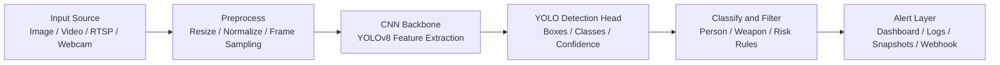
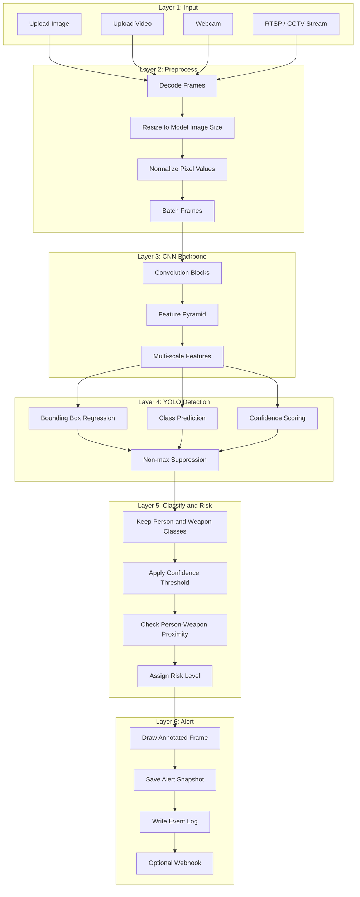

# Drishti Architecture

## Overview

## Detailed Layer Breakdown

## Data Flow

The system accepts a frame source, converts it into model-ready frames, runs YOLOv8 inference, filters detections into application-level events, then records or displays the result.

The current baseline treats `weapon` detections as high risk and `person` detections as context. If the model is trained with more specific classes such as `gun`, `knife`, or `rifle`, keep those names in `configs/data.yaml` and update `WEAPON_CLASS_NAMES` in `src/drishti/config.py`.

## Training Flow

1. Collect YOLO-format weapon/person data.
2. Update `configs/data.yaml`.
3. Train with `scripts/train_yolo.py`.
4. Evaluate predictions in `runs/detect`.
5. Use best weights in `scripts/detect.py` or `streamlit_app.py`.

